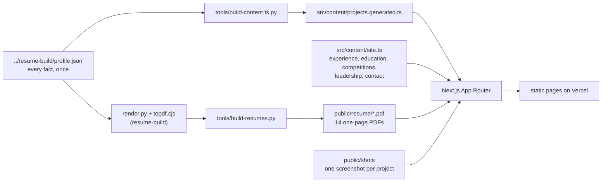
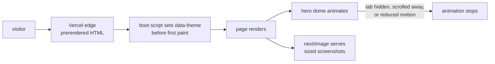

# adarshdwivedi

Personal site for Adarsh Dwivedi: 28 shipped projects across six domains, each with a
case study, the full competition record, the leadership work, and fourteen
role-specific resumes.

**Live:** https://adarshdwivedi.site

`portfolio` `nextjs` `react` `typescript` `tailwindcss` `framer-motion` `static-site`

## Why it is built this way

The site does not restate the resumes. It is generated from the same file they are.

`../resume-build/profile.json` holds every factual claim once: the numbers, the stacks,
the links, the per-audience phrasings. `tools/build-content.ts.py` reads it and emits
`src/content/projects.generated.ts`, and `tools/build-resumes.py` copies the built PDFs
in. Change a number in one place, rebuild both, and a resume and a case study cannot end
up disagreeing six months from now.

Only what a resume has no room for is hand-written, in `src/content/site.ts`: the
internship detail, education, the competition record with every outcome, the Debate
Society and MUN history, interests and contact lines.

## Key features

| Feature | Detail |
|---|---|
| Case studies | One page per project, 28 of them, prerendered, each with a real screenshot |
| Six domains | Public-interest AI, clinical and diagnostic AI, trust and verification, agents and AI infrastructure, data and decision systems, systems and foundations |
| Competitions | 23 entries in three tiers, rejections stated as rejections |
| Leadership | Debate Society role history, LNMIIT MUN'26 and MUN'25 with figures and photographs |
| Contact | Direct cards with copy buttons, brand-marked profile arrows, live Jaipur time |
| Resumes | Fourteen one-page PDFs in a popup, grouped by role family |
| Themes | Dark by default with a designed light theme, persisted per visitor |
| Navigation | Centred route bar, a pinned current-page chip, previous and next page at every page end |
| Accessibility | Skip link, reduced-motion support, visible focus, contrast audited in both themes |

## Tech stack

| Layer | Choice |
|---|---|
| Framework | Next.js 16 App Router, React 19, TypeScript |
| Styling | Tailwind CSS 4 with hand-written tokens in `globals.css` |
| Motion | Framer Motion for reveals, a canvas 2D ice dome in the hero |
| Type | Bricolage Grotesque, Geist and Geist Mono through `next/font` |
| Icons | Brand marks copied in from Simple Icons (CC0), no icon package |
| Tooling | Python and Playwright scripts for content, screenshots and the audit |
| Hosting | Vercel, static output |

## Architecture



One source feeds two outputs. The PDFs the site offers are the same artefacts the resume
build produces, copied in rather than rewritten. Screenshot URLs carry a hash of the
shots, so replacing an image changes its URL and no cache keeps serving the old one.

## Request flow



Everything is prerendered, so there is no application server on the request path and no
data fetching at runtime.

## Project structure

```
portfolio/
├── src/
│   ├── app/
│   │   ├── page.tsx              # home
│   │   ├── work/                 # project browser and work/[slug] case studies
│   │   ├── about/  competitions/  leadership/  contact/
│   │   ├── icon.png  apple-icon.png  favicon.ico  manifest.ts
│   │   └── globals.css           # tokens for both themes and every component style
│   ├── components/               # Chrome (nav, theme), Footer, PagePager, Icons,
│   │                             # ProfileArrows, ResumePicker, IceDome, motion
│   └── content/
│       ├── site.ts               # hand-maintained
│       ├── projects.generated.ts # generated, do not edit
│       └── resumes.generated.ts  # generated, do not edit
├── public/
│   ├── shots/                    # project screenshots, 2160x1350
│   ├── photos/                   # portrait, internship and MUN photographs
│   └── resume/                   # 14 PDFs
└── tools/
    ├── build-content.ts.py       # profile.json to projects.generated.ts
    ├── build-resumes.py          # sync PDFs and regenerate the resume index
    ├── shots.cjs  shot-tab.cjs   # capture live apps with Playwright
    ├── fit-shot.py  install-shot.sh  terminal-shot.py
    └── audit.cjs                 # contrast, overflow and broken images, both themes
```

## Getting started

```bash
npm install
python3 tools/build-content.ts.py
npm run dev
```

The site runs at http://localhost:3000. Build and serve the production output:

```bash
npm run build && npm run start
```

## Testing

```bash
node tools/audit.cjs
```

The audit walks every main route in the light and dark themes at desktop and phone
widths, and fails on text below WCAG AA contrast, horizontal overflow and broken images.
The resumes are checked in `../resume-build` with `python3 verify.py`, which parses each
PDF with poppler and pdfminer the way an applicant tracking system would.

## Adding things

- **A project, or a changed number:** edit `../resume-build/profile.json`, rerun
  `tools/build-content.ts.py`, and rebuild the resumes so the two agree.
- **Which domain a project sits in:** the `DOMAINS` list in `tools/build-content.ts.py`.
- **A project screenshot:** `python3 tools/fit-shot.py <slug> <image> [top|center]`,
  then rerun `tools/build-content.ts.py` so the shot URL picks up the new hash.
- **A competition, role, interest or contact line:** `src/content/site.ts`.
- **Resumes:** rebuild in `../resume-build`, then `python3 tools/build-resumes.py`.

## Deployment

Vercel project `adarshdwivedi`, linked to this repository. Every push to `main` deploys
production, and other branches get protected preview deployments. There are no
environment variables and no runtime secrets, because the site holds no server state.
HTTPS is issued automatically, including for a custom domain once one is attached.

## Roadmap

- Attach the custom domain and move `metadataBase` to it
- Confirmed outcomes for the competitions still awaiting a result
- A keep-awake ping for the Streamlit demos that sleep after inactivity

## License

MIT for the code. The photographs and resumes are not covered by it.

## Contact

Adarsh Dwivedi, [LinkedIn](https://www.linkedin.com/in/adarshdwivedi30/),
[GitHub](https://github.com/adarshcod30), 23ucs509@lnmiit.ac.in
