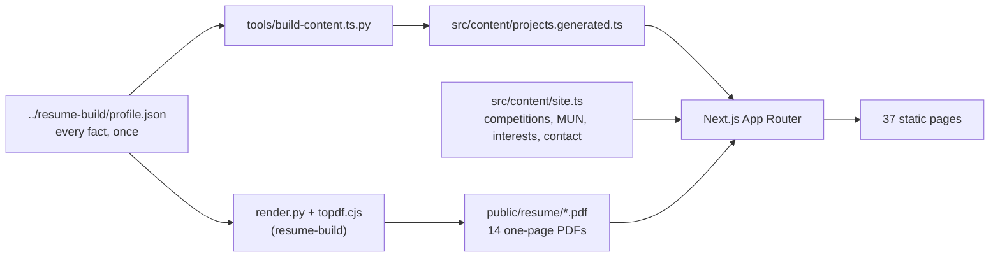
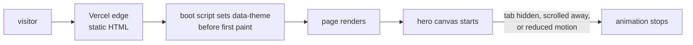

# adarshdwivedi.dev

Personal site for Adarsh Dwivedi: 26 projects across five domains, the competition
record, the leadership work, and fourteen role-specific resumes.

**Live:** https://adarshdwivedi.vercel.app

`portfolio` `nextjs` `react` `typescript` `tailwind` `static-site`

## Why it is built this way

The site does not restate the resumes. It is generated from the same file they are.

`../resume-build/profile.json` holds every factual claim once: the numbers, the stacks,
the links, the per-audience phrasings. `tools/build-content.ts.py` reads it and emits
`src/content/projects.generated.ts`. Change a number in one place, rebuild both, and a
resume and a case study cannot end up disagreeing six months from now.

Only the things a resume has no room for are hand-written, in `src/content/site.ts`:
the competition record, the MUN and society history, interests and contact details.

## Key features

| Feature | Detail |
|---|---|
| Case studies | One page per project, 26 of them, prerendered as static HTML |
| Domain grouping | Public-interest AI, trust and verification, agents and infrastructure, data and decision systems, systems and foundations |
| One motion moment | A canvas node field in the hero, then calm. No WebGL, no scroll hijacking |
| Theme | Light by default with a dark toggle, persisted per visitor |
| Live status | Availability, location and local Jaipur time, so a recruiter abroad knows the hour |
| Resumes | Fourteen role-specific PDFs served straight from `public/resume` |
| Accessibility | Skip link, reduced-motion support, real focus states, semantic landmarks |

## Tech stack

Next.js 16 App Router, React 19, TypeScript, Tailwind CSS 4, Geist, canvas 2D for the
hero. No animation library in the critical path and no external font or script beyond
the self-hosted Geist faces.

## Architecture



One source feeds two outputs. The PDFs the site offers for download are the same
artefacts the resume build produces, copied in rather than rewritten.

## Request flow



Everything is prerendered, so there is no server on the request path and no data
fetching at runtime.

## Project structure

```
portfolio/
├── src/
│   ├── app/                 # routes: /, work, about, competitions,
│   │   └── work/[slug]/     # leadership, gallery, resume, contact
│   ├── components/          # Chrome (nav, theme, status), NodeField, UI kit
│   └── content/
│       ├── site.ts                    # hand-maintained
│       ├── projects.generated.ts      # generated, do not edit
│       └── resumes.generated.ts       # generated, do not edit
├── public/
│   ├── photos/              # gallery and leadership images
│   └── resume/              # 14 PDFs
└── tools/build-content.ts.py
```

## Getting started

```bash
npm install
python3 tools/build-content.ts.py   # regenerate project content from profile.json
npm run dev                         # http://localhost:3000
```

Build and preview the production output:

```bash
npm run build && npm run start
```

## Adding things

- **A new project, or a changed number:** edit `../resume-build/profile.json`, rerun
  `tools/build-content.ts.py`, and rebuild the resumes too so the two agree.
- **Which domain a project sits in:** the `DOMAINS` list at the top of
  `tools/build-content.ts.py`.
- **A competition, society role or interest:** `src/content/site.ts`.
- **A photograph:** drop the file in `public/photos` and add a row with a real caption
  to the `PHOTOS` list in `src/app/gallery/page.tsx`.

## Deployment

Vercel, static output, deployed from `main`. No environment variables and no runtime
secrets, because the site holds no server state.

## Roadmap

- Portrait and a fuller photography gallery
- Per-project screenshots on the case-study pages
- Confirmed results for the hackathons still awaiting an outcome

## License

MIT for the code. The photographs are not covered by it.

## Contact

Adarsh Dwivedi, [LinkedIn](https://www.linkedin.com/in/adarshdwivedi30/),
[GitHub](https://github.com/adarshcod30), 23ucs509@lnmiit.ac.in
